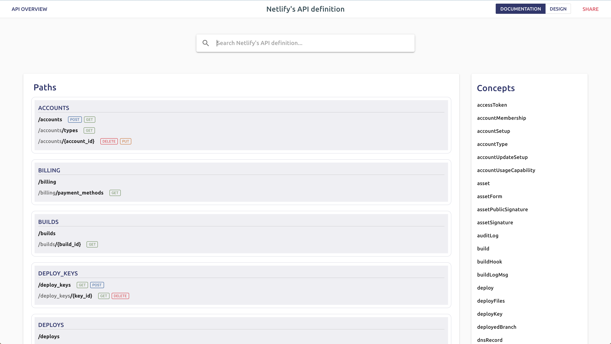
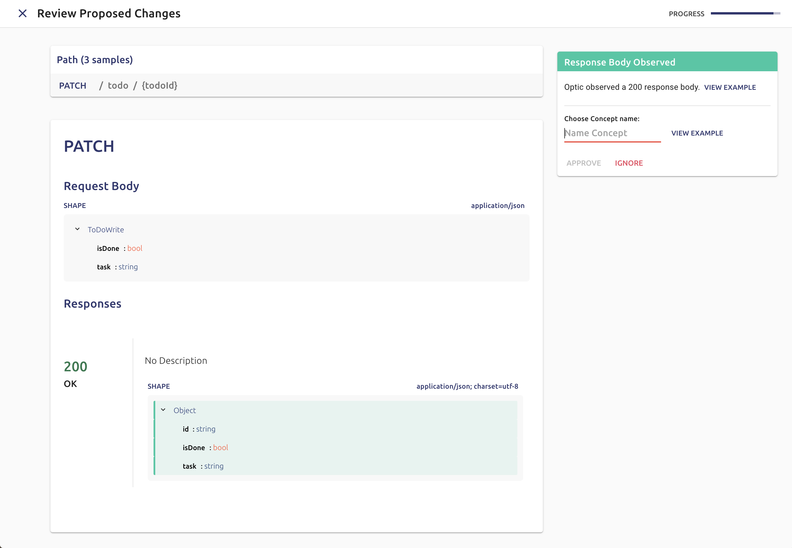

<h1 align="center">
  <br>
  <a href="https://useoptic.com”></a>
  <br>
  Optic
  <br>
</h1>

<h4 align="center">Developer Friendly APIs</h4>

<p align="center">

</p>

<p align="center">
  <a href="#key-features">Key Features</a> •
  <a href="#how-to-use">How To Use</a> •
  <a href="#installing-optic">Installing Optic</a> •
  <a href="#license">License</a>
</p>



## Key Features
📝**Easily Document any API** - We built Optic to make maintaining accurate specs for your APIs automatic and developer friendly. Once you add Optic to your API repo, it automatically tracks your API’s behavior and maintains a change log of its behavior over time.

It’s kind of like Git, but instead of tracking files, Optic automatically diffs and tracks API endpoints. When new behavior is observed, Optic makes it easy to update the spec: 


🎨**A powerful API designer** - Optic ships with an open source API design tool that makes it easy to read and modify your API specification. 

👋**100% Open Source, Runs locally, data is only stored in your API Repo**

## How to Use
Optic learns and monitors your API's behavior by using a local proxy. To run your API with the Optic proxy in front of it, use Optic's `api start` command instead of `npm start`, `rails server`, etc. 

```bash
demo$ api start
[optic] Starting ToDo on Port: 3005, with npm run server-start

> tododemo@0.1.0 server-start 
> babel-node server/server.js
```
Your API will behave normally when you run it with `api start`, but when Optic observes behavior that isn't in your API spec, it notifies you:
```bash
[optic] New behavior was observed. Run api spec to review.
```
Seeing this message means that Optic has observed a non-empty diff between your API specification and your API's actual behavior. You can review this diff by running `api spec` and either merge Optic's proposed changes into your API spec or mark the new behavior as a bug. Here's a 5 min video showing this entire process end-end:
### [Watch Video on Youtube](https://www.youtube-nocookie.com/embed/WjC4Fqyyi5E)

## Installing Optic
```bash
npm install @useoptic/cli -g
# or using yarn
yarn add global @useoptic/cli
```
### Add Optic to your API

```bash
cd path/to/api
api init
```


This command adds a folder called '.api' that tracks the evolution of your API. This is similar to how Git uses the '.git' folder to track your code.

```bash
.api/
├── api.yml # The file that configures Optic
├── readme-docs.md # A readme that explains how to use Optic (for your teammates)
├── .gitignore # Optic's gitignore. We want to keep your repo clean :) 
└── spec-store.json # The API spec Optic manages
```

The Optic proxy will make your API available on the port you use today and will assign your API another port to run on with an environment variable named: `OPTIC_API_PORT`. You should update your API code to start on `OPTIC_API_PORT` while in development so Optic can properly forward it traffic. There are [language / framework specific example of these code changes here.](https://dashboard.useoptic.com) 

## License 
MIT
