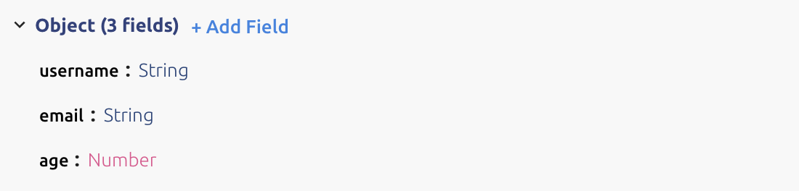
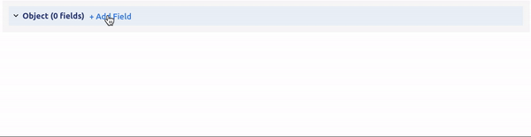
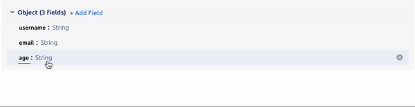
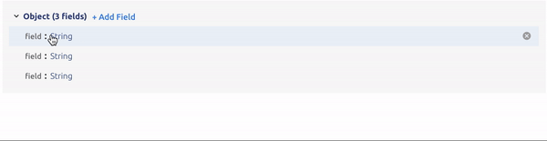
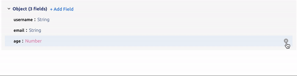

# Concepts
APIs expose the important concepts from your domain to your consumers. These concepts are often things like User, Account, Threads, Orders, etc. If you import your OpenAPI/Swagger specification, we will map each schema to a concept. 

All concepts are named, and they define the shape of the data representing the concept.   

## Creating new Concepts
New concepts can be created by entering design mode, and clicking `+ Add Concept` in the navigation bar. This brings you to a blank concept page where you can add the name and a description for the concept. Once you have named the concept, you can begin filling in its shape. 

## Editing Shapes
Optic includes a powerful shape editor that makes it easy to create and modify the shape of your concepts. It looks like this: 

The shape editor supports the following primitives, where `T` is a generic type you can assign:  

- `Object`
- `String`
- `Number`
- `Int`
- `Boolean`
- `List[T]`
- `Map[String, T]`
- `Any`

You can also reference any other concept by pressing `Select Concept`. In the editor you will see the typename as the concept you reference. 

<!-- There is also an `OR` union type that will allow you to assign a type
...add details here 

## Objects
As in JSON, objects are represented as Maps with keys of `String` to values of `Any` (`Map[String, Any]`). Objects can have an arbitrary number of fields, each of which can be assigned to a type.  

### Add a new field 

### Change a type 

### Rename a field

### Delete a field

## Referencing other concepts

## Generics

## Unions

!--> 
