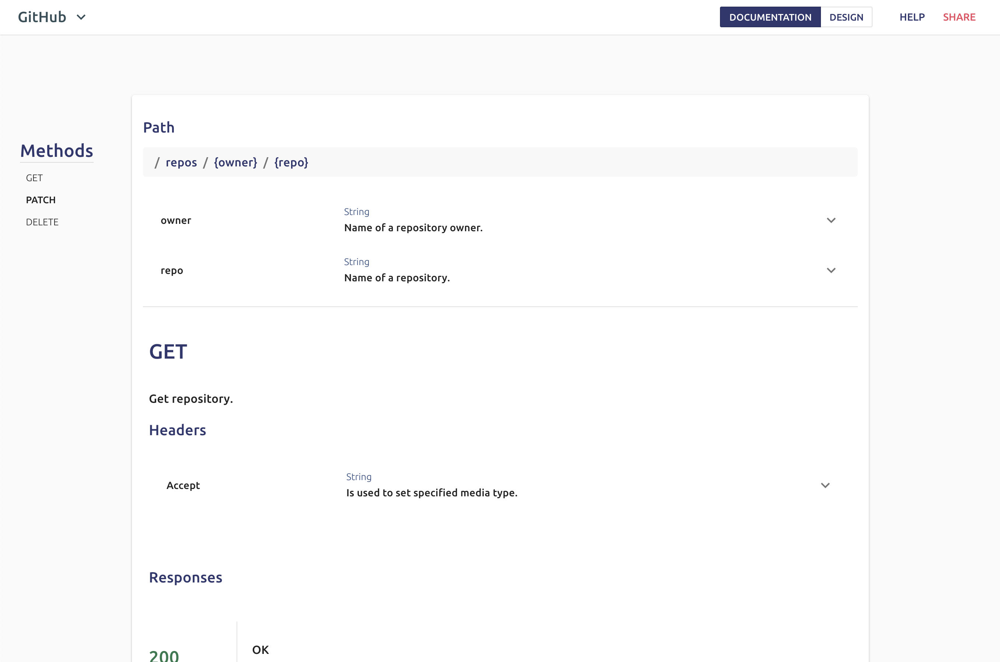

# Requests
In Seamless, API endpoints are grouped by their paths. For example, the following requests would show up on the same page within the designer:
```
Repository by ID:

GET /repos/:owner/:repo
PATCH /repos/:owner/:repo
DELETE /repos/:owner/:repo
```



You can check out this example live in [GitHub's Seamless Docs](https://editor.seamlessapis.com/examples/github/paths/EeweRC_path_54#path_nSD4MILoql}_get). 

## Adding a new Request
To add a new request, enter Design mode then click `+Add Request` in the navigation bar.  

**1. Choose your path:**

Paths are built one component at a time. 
- To represent a path parameter, use `:paramName` or `{paramName}` syntax.
- To advance to the next component of the path, press `/`.
- To go back to a previous component, use the backspace key. 


**2. Check all the request methods you'd like to create:**

You can always come back later and add additional methods.


**3. Click 'Create Requests':**

Seamless will create the requests and redirect you to the page showing the resources you have created.

## Editing Requests
In Design mode, Seamless will display the editors for creating, modifying, and deleting a request's parameters, responses, and body.
