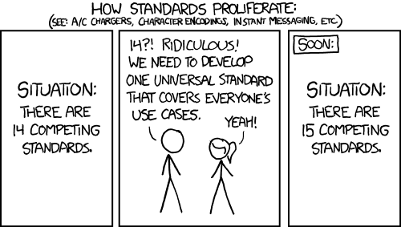

# Problems with API Specifications

### and how Seamless built a better one...

When we set out to build better tooling for APIs one of the first questions we had to ask ourselves was whether we should create our own API specification format or choose to interoperate with an existing standard. 

OpenAPI/Swagger has a lot of momentum and it seemed like choosing it as the backing representation for Seamless would be the de facto "right move". There was also comic wisdom pushing us towards an existing standard like OpenAPI, RAML, API Builder, or API Blueprint.

 

## What is a specification?

Before choosing one course over another we spent time thinking about the problem anew from first principles.

Specifications or 'specs' describe the behavior of a piece of software specifically and with precision. The most useful specs for programmers are ones that can be read by both a machine and a human. 

API specifications describe the interface of a program that can be accessed over the wire. Contemporary examples include an OpenAPI file, a protobuf definition, or graphQL schemas. They should ideally be:

- Simple for humans to work with. Have a great developer experience
- Faithfully represent the behavior of the interface they describe
- Represent the domain with rich abstractions that are useful for the job-to-be-done (design, code generation, doc gen)
- Stable — breaking changes in complex specification are expensive for users and toolmakers to work with.
- Easy for tooling built on the spec to query the data they need. The interface should be stable for many years and the domain logic should not have to be replicated in tooling itself

## Retiring an old idea

One of the principle assumptions baked into every competing API specification today is that the specs must be persisted in a human readable, human writable, and machine readable format. In practice this ends up being a one giant YAML or JSON file.

Finding a healthy intersection of these three competing concerns is difficult to achieve and riddled with tradeoffs. Here are some important examples: 

- **Human** **Readability tradeoff:** APIs are more naturally represented as graphs. Don't believe us? Control-f and count how many times '$ref' occurs in your spec. It's difficult for humans to read a graph in linear text form, so API spec standards use trees to better communicate structure and relationships.
    - **Impact on machine readability:** This puts a huge burden on each toolmaker who now has to resolve the $refs and re-graphiphy everything before they can do anything interesting with your spec.
- **Human** **Writability tradeoff:** There are shorthands throughout spec standards today that try to make them easier to author. Example include keywords that define authentication patterns, and the use of $refs to aid in DRY (don't repeat yourself).
    - **Impact on machine readability:** When the specification isn't explicit and contains shorthands like 'bearer' for auth, or other semantics that are defined by the spec standards itself, tools need to stay and current and re-implement the domain logic themselves.
    - **Impact on human readability:** API specs today are hard to read because of many of the same features that make them more writable. Seeing that a response is $ref: OrderType means I have to find OrderType, the 3 other other types referenced there, and build the flattened schema in my head.
- **Machine Readability tradeoff:** To make an API specification readable by machines they must use a strict syntax (JSON or YAML), and conform to a tightly specified schema.
    - **Impact on human readability:** JSON isn't easy to read, esp when it's 10k + lines.
    - **Impact on human writability:** Nobody is born writing YAML, or with perfect intuition about an API spec standard. Even experts spend a lot of time fighting the tooling

> This shape of this problem means you can not solve it with ordinary thinking.  The more you optimize for writability, the more difficult you're going to make machine + human readability. The better it's made for machines + tooling, the worse off it is for humans to write.

## CQRS to the rescue

Through this lens, the root problem with current spec standard becomes obvious: there is only one model, that is used for both read/write, and has to support the needs of both humans and machines. We can all agree that's a lot to realistically expect from a single data model. 

We need models optimized for:

- **Human Readability**: so programmers can easily read and understanding the API being specced
- **Human** **Writability:** so programmers can quickly write and modify the spec with productive abstractions
- **Machine Readability:** so tools can query the information in the spec relevant to them. Ideally with something like graphQL.

But how can we get all 3 of those at once? 

Enter CQRS (command-query-responsibility-segregation). Microsoft's docs explain that CQRS "separates reads and writes into separate models, using commands to update data, and queries to read data." 

Once we sketched out an API spec built around the principles of CQRS and Event Sourcing, things quickly fell into place. Separating concerns would allow us to optimize each use case without introducing tradeoffs. 

New designs, and rethinking old norms change the shape of a problem space in a way that allows real progress. 

## Making it concrete

At the center of our implementation is the open source [Seamless domain engine]. It can run on the JVM or in Node making it portable just about everywhere. At a high level, the domain engine interprets commands and handles queries. You can think of this as sort of a living specification. Instead of just being a flat file, it's an actual program that answers your queries, and modifies the internal API specification in response to your commands. 

That internal API specification is an event stream of every change you've made to your API since you started using Seamless. These events are played back every time you start the domain engine to build the current specification for your API. Each of these events are immutable facts about the API like RequestAdded, RequestBodyContentTypeSet, etc. We don't have to argue over syntax, semantics or structure, or even concern ourselves with humans reading or writing these directly. Events are pure descriptions of the API domain. 

Commands for the API spec domain might be things like AddQueryParameter, CreatePath, ChangeMethod, UseSchema, AddResponse, etc. It wouldn't be very human friendly to make a programmer write all the commands in sequence so we've also shipped an open source API Design tool similar to Stoplight or RedHat's Apicurio. The Seamless API designer sends commands to the domain engine in response to actions taken in the UI. Visual OpenAPI designers are exploding right now — it seems inevitable that most teams will adopt one especially as the OpenAPI format becomes more complex. We'd like it if readers used ours, but we've seen how productive CQRS makes tool-builders and hope every tool adopts our domain engine.

[ DESIGN TOOL GIF ]

> See that API Designer? It's damn polished and is more stable than any MVP tool of this complexity we've used. It took 3 weeks to build the domain engine and API Designer app. CQRS backed by a good domain design is that productive.

## Query what you need

In CQRS queries return projections, custom read models that are highly optimized for a specific use case. Some example projections might be:

- A list of endpoints — that's all you get, nothing you don't need.
- A list of schemas / types
    - Represented as a list of rules (great for building a test suite)
    - with all their references flattened
    - as JSON schema
- Your API represented in OpenAPI — a traditional spec format is just another projection of the core data model. Even some of Seamless's more advanced features like support for Generics can be projected onto OpenAPI
- the changes made since the last version of the API
- a projection optimized for generating
    - clients
    - API implementations
    - test suites
    - make your own

Because these queries are based on the event stream used for persistence they're guaranteed to be stable for two reasons: 

- As a tool-builder, you can in-source the queries and projections you need to your own codebase. Imagine if OpenAPI was structured in a way that mapped more cleanly onto the domain of the tools you're building for it — forever — guaranteed.
- We won't accept breaking changes to projections in the main project. If you need to change the projection in a breaking way, you'll be asked to name the query something else.

## Benefits

We just unpacked a lot about the architecture, now let's discuss the practical, bread-on-the-table value of representing our APIs in this way. 

### Developer Experience

Seamless both enables and requires better API design tools since nobody is going to run commands manually. The market is already moving towards structured API editors and the battle is on to improve developer experience. Once you strip away the complexity of parsing and mutating a traditional API spec, your team can focus on building a great UX — see our editor (and its source) as an example.

Seamless also makes it possible to imagine an explosion of specialized tooling built around the API design experience. Because of the way projections and commands work, a bunch of really awesome Schema Editors could be built that only concern themselves with only the schema events/commands. There could be tooling for generating tests built around its own set of specialized events/commands. It's fine if tools only implement queries and commands relevant to their domain.

### Richer Abstractions

With concerns separated properly, it's easier to implement richer abstractions to represent APIs. Many API architects want to define reusable standards for things like pagination, but this isn't easily supported by JSON Schema. In Seamless it was easy for us to support generics. Now our schemas can take other schemas as type parameters InfiniteScrollPagination[UserType] or PageBasedPagination[UserType]. Generics make API standards sharable between a team's APIs and could one day support sharing popular standards and components on GitHub.

A major unsolved challenge in OpenAPI-land is diffing a spec. Proper diffs would help prevent breaking changes, generate semantic change-logs, and would provide safety for teams that use code-first workflows. One of the main challenges here (besides the complex data structure) is that changes to a flat JSON/YAML file lose their intent. How can you know a query parameter was renamed 'foo' → 'bar'? A normal diff of the JSON would show 'foo' being deleted and 'bar' being added. 

In Seamless every change is an event that captures intent so you can easily build a semantic diff as a projection. In fact there's an open feature request right now that displays changes to the API spec whenever you pull the repo. 

Finally — in the real world teams are using a combination of REST, graphQL, Websockets, and RPCs, often times within the same APIs. A traditional spec combining all these paradigms would collapse under the weight of its own complexity, but it is possible to imagine Seamless supporting multiple paradigms and sharing schemas between them. We suspect this kind of interoperability to become more important in the next few years — especially in enterprise settings. 

### Governance

The way Seamless's domain is set up means that contributors just have to answer one question "What can we say about a REST API?"

If it can have requests then we need an event for RequestAdded.

If each request can have query parameters we need an event for QueryParameterAdded 

If each query parameter can have a shape we need ParameterShapeSet

Do we need to support generics? That's just 2 new events and 1 query, [see pr].

Keeping the domain simple, representative and pure is the most important task and that's much easier for a group of contributors to manage compared to a traditional spec standard.

Once the domain modeling is taken care of, the needs of toolmakers will direct the development of the Commands and Queries that get built. 

## Tradeoffs

There are some clear tradeoffs to this design as well. 

- Seamless does rely on GUI API Designers to be built around it. We've shipped an awesome open-source one to get things started, but we need more competitive solutions to grow and evolve in parallel.
- Thinking in CQRS is hard. Contributors who are unfamiliar with the concepts will have to invest their time and mental energy in learning. However, thinking in OpenAPI, RAML, or API Blueprint is pretty difficult as well. We think it's easier to ask a small group of contributors to learn CQRS so that the millions of developers who need to design their APIs can benefit from better tooling.
- While CQRS naturally supports collaborative editing, the infrastructure needed to distribute events across clients is complex and relies on eventually consistency. Microsoft does a better job of explaining the tradeoffs of using [CQRS to represent your data here](https://docs.microsoft.com/en-us/azure/architecture/patterns/cqrs).

## OpenAPI Support

We've used OpenAPI for many years and believe it'll remain a going-concern for a long time. To make it easier to get started with Seamless we built an OpenAPI importer with support for version 2 and 3. You can [upload your spec here to try out Seamless]. 

There's also a projection in progress that outputs valid OpenAPI 3 that should play well with your existing tools. 

Cool aside: The architecture for the importer is inspired by GraphQL and allows us to query the information we need from the spec directly. The resolvers manage the differences between versions 2 and 3. Check out the source here

# Closing

> Traditional specifications form communities around the same schema. We imagine our specification will form communities around the same jobs to be done.

Nobody wakes up thinking, "today we're going to build another way to spec APIs" — we certainly didn't.

We believe every API should interoperate Seamlessly. This isn't going to be the case until consuming APIs is as easy as installing node modules, and designing them is a fluid experience. 

Despite there being server generators, SDK generators and spec standards for over a decade, connecting APIs and clients isn't effortless for most teams. Don't get us wrong, there are many teams who have a good end-to-end process and they reap enormous benefits — there's so much cool work out there. As they say, "the future is here, it's just not evenly distributed". 

We think a better API spec, that enables a whole new ecosystem of tooling, is a critical piece of infrastructure and we're happy to open source our work and give it to the community. 

We look forward to hearing your comments, ideas and concerns and working on ways to incorporate them into the project

- GitHub
- Issues
- Docs
