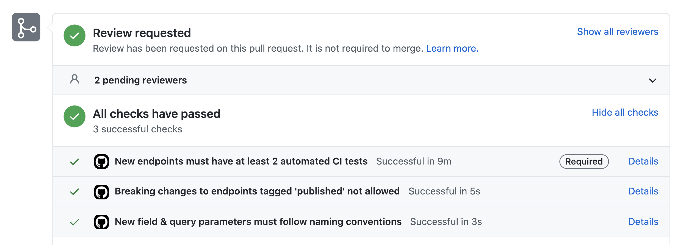

:::info Join the Beta
API Checks are in active development, and we're still experimenting with early users. If you would like to get early access and help chart the course for this feature, [set up a call](https://calendly.com/opticlabs/optic-demo-with-the-maintainers)
:::

Today’s API teams understand the importance of building forwards-compatible APIs, that conform to standards and meet the consumer’s requirements — all while securing sensitive information and respecting user privacy. As the number of APIs inside every organization grows, so too does the impetus to make those new APIs secure, stable and consumer-friendly.

The best way to help developers build great APIs is to make following standards and best practices easy & developer-friendly. The more you can automate the feedback, and the further left (towards the developer) you provide it, the more likely these efforts are to succeed. To create this experience for your developers you need the right data and feedback mechanisms:

- **Up-to-date specifications** -- Optic keeps a version of your API specification that always represents the current state of your API.

- **Feedback during the actionable window** -- There’s a really short “window” to provide feedback about the APIs teams build. Once new endpoints or changes to existing ones get deployed to consumers, the behavior of that API will come to be depended upon, making it much more expensive to change later. Optic provides feedback right in the PR, before changes get merged to consumers.

- **Change oriented** -- Optic lets you write custom checks about the proposed API changes in each PR. Since it's not linting the entire specification, the signal/noise ratio is very high and developers can easily understand what changes they need to make.

## Checks
Optic provides some common built-in checks that are easy to add to your CI process, and a scripting interface that makes it easy to write checkers on your own without being an OpenAPI expert. Within each check, Optic collects useful context for the checkers you write:

- New Endpoints
  - the shape of every request/response
  - the names of every new field
  - the names of every new query parameter
  - coverage from automated tests
- Changes to existing endpoints
  - location of the change
  - is it breaking?
  - type for this field before / after changes
  - who made it? what was their commit message?
  - [Advanced] which internal teams are affected by this change?
  - [Advanced] which external consumers are affected by this change?
  - [Advanced] what % of our real API traffic is impacted?
    - [Advanced] is usage up or down? trendline

import Paper from '@material-ui/core/Paper';

<Paper elevation={2}>

  

</Paper>

## Advanced Checks
Team's using the Optic Platform are able to enhance their API Checks with useful information that can only be derived from looking at real traffic in development, staging and production environments. When Optic is running in these real environments it can build a graph of each API's consumers, and learn what subset of the API each consumer uses.

This makes it possible to build check that add a lot of value for larger teams. Instead of just saying something is breaking, the check can tell you:

> this is a breaking change for 3 internal consumers [payment-collection, shipping-usa, shipping-canada]

The next step may be to send an invitation to representatives from each of those teams to review the PR, or if you discover that your changes would break a critical consumer, it might make sense to block merging until a compatible change is proposed.

