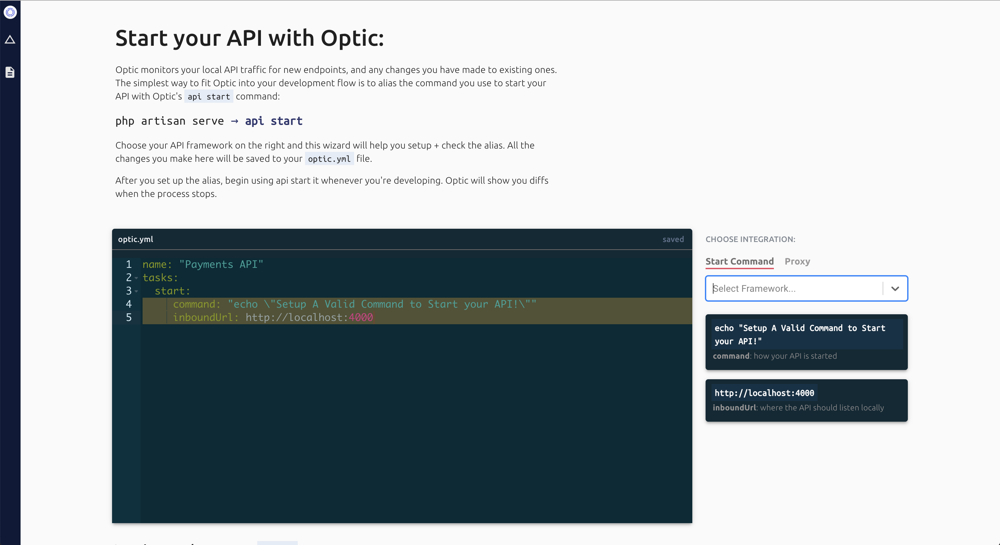

import Tabs from '@theme/Tabs';
import TabItem from '@theme/TabItem';
import GitHubButton from 'react-github-btn';

### 1. Download the CLI
<Tabs
  defaultValue="yarn"
  values={[
    {label: 'yarn', value: 'yarn'},
    {label: 'npm', value: 'npm'},
    {label: 'brew', value: 'brew'},
  ]}>
  <TabItem value="yarn">

```bash
yarn global add @useoptic/cli
```

  </TabItem>
  <TabItem value="npm">

```bash
npm install @useoptic/cli -g
```

  </TabItem>
  <TabItem value="brew">

```bash
brew install opticdev/optic/api
```

  </TabItem>
</Tabs>

:::note
Optic requires Node v12+, and we'll install a compatible version as a requirement via your package manager of choice. Depending on your installation method and node version management process, it's possible to get into a state where an incompatible version of Node is running. If you need to check, `api --version` will tell you both the Optic CLI and Node version running. If you run into an issue here, please [let us know](https://github.com/opticdev/optic/issues/new?title=Node%20Version%20Incompatibility%20Issue:).
:::

#### While that’s downloading 👇

- [Join the new Optic Community on Discord](https://discord.gg/t9hADkuYjP)

- Show your appreciation with a ⭐ on GitHub
<div style={{paddingTop: 0}}>
  <GitHubButton
    href="https://github.com/opticdev/optic"
    data-icon="octicon-star"
    data-size="large"
    data-show-count="true"
    aria-label="Star opticdev/optic on GitHub"
  >
    Star
  </GitHubButton>
</div>


### 2. Add Optic to your API
Initialize Optic in your API's root directory:

`cd /path/to/api`

```bash
api init
```
Follow the on-boarding flow and set up an `api start` alias:

<div style={{textAlign: 'left', maxWidth: 500}}>



</div>


<div style={{height: 30}} />

Explore our docs to learn more about [running your tests with Optic](/docs/get-started/testing), [installing the GitBot](/docs/apiops/pull-requests), and [sharing Optic with your team](docs/using/share-with-team).


## Next Step: [Configure API Tasks](/docs/get-started/config)


---

## How can I get involved in the project?
Some of the most valuable contributions to an open source project are written in prose, not code. Developers taking the time to share their feedback, perspective, and ideas with the broader community are the oxygen of big projects like Optic.

**[Get Involved](/docs/optic/get-involved)**

## Who made this?

<!-- ALL-CONTRIBUTORS-LIST:START - Do not remove or modify this section -->
<!-- prettier-ignore-start -->
<!-- markdownlint-disable -->
<table>
  <tr>
    <td align="center"><a href="http://aidancunniffe.com"><br /><sub><b>Aidan Cunniffe</b></sub></a><br /><a href="https://github.com/opticdev/Optic/commits?author=acunniffe" title="Documentation">📖</a> <a href="https://github.com/opticdev/Optic/commits?author=acunniffe" title="Code">💻</a></td>
    <td align="center"><a href="https://devdoshi.com"><br /><sub><b>devdoshi</b></sub></a><br /><a href="https://github.com/opticdev/Optic/commits?author=devdoshi" title="Documentation">📖</a> <a href="https://github.com/opticdev/Optic/commits?author=devdoshi" title="Code">💻</a></td>
    <td align="center"><a href="https://www.take2.co/consulting-development"><br /><sub><b>Evan Mallory</b></sub></a><br /><a href="https://github.com/opticdev/Optic/commits?author=esopian" title="Documentation">📖</a></td>
    <td align="center"><a href="http://www.jaaprood.nl/"><br /><sub><b>Jaap van Hardeveld</b></sub></a><br /><a href="https://github.com/opticdev/Optic/commits?author=JaapRood" title="Code">💻</a> <a href="https://github.com/opticdev/Optic/commits?author=JaapRood" title="Documentation">📖</a></td>
    <td align="center"><a href="https://twitter.com/trulyronak"><br /><sub><b>Ronak Shah</b></sub></a><br /><a href="https://github.com/opticdev/Optic/commits?author=trulyronak" title="Code">💻</a> <a href="https://github.com/opticdev/Optic/commits?author=trulyronak" title="Documentation">📖</a></td>
    <td align="center"><a href="https://github.com/taraedits"><br /><sub><b>taraedits</b></sub></a><br /><a href="https://github.com/opticdev/Optic/commits?author=taraedits" title="Documentation">📖</a></td>
    <td align="center"><a href="https://github.com/LouManglass"><br /><sub><b>Lou Manglass</b></sub></a><br /><a href="https://github.com/opticdev/Optic/commits?author=LouManglass" title="Code">💻</a> <a href="https://github.com/opticdev/Optic/commits?author=LouManglass" title="Documentation">📖</a></td>
  </tr>
  <tr>
    <td align="center"><a href="https://github.com/notnmeyer"><br /><sub><b>Nate Meyer</b></sub></a><br /><a href="https://github.com/opticdev/Optic/commits?author=notnmeyer" title="Code">💻</a></td>
    <td align="center"><a href="https://github.com/timgates42"><br /><sub><b>Tim Gates</b></sub></a><br /><a href="https://github.com/opticdev/Optic/commits?author=timgates42" title="Documentation">📖</a></td>
    <td align="center"><a href="https://github.com/matthewhudson"><br /><sub><b>Matthew Hudson</b></sub></a><br /><a href="https://github.com/opticdev/Optic/commits?author=matthewhudson" title="Documentation">📖</a></td>
    <td align="center"><a href="https://github.com/lvenier"><br /><sub><b>LaV</b></sub></a><br /><a href="https://github.com/opticdev/Optic/commits?author=lvenier" title="Documentation">📖</a></td>
    <td align="center"><a href="https://github.com/gaurav-nelson"><br /><sub><b>Gaurav Nelson</b></sub></a><br /><a href="https://github.com/opticdev/Optic/commits?author=gaurav-nelson" title="Documentation">📖</a></td>
    <td align="center"><a href="http://ross-nordstrom.github.io/"><br /><sub><b>Ross Nordstrom</b></sub></a><br /><a href="#design-ross-nordstrom" title="Design">🎨</a> <a href="https://github.com/opticdev/Optic/commits?author=ross-nordstrom" title="Code">💻</a> <a href="https://github.com/opticdev/Optic/issues?q=author%3Aross-nordstrom" title="Bug reports">🐛</a></td>
    <td align="center"><a href="http://kinlane.com/"><br /><sub><b>Kin Lane</b></sub></a><br /><a href="#ideas-kinlane" title="Ideas, Planning, & Feedback">🤔</a> <a href="#content-kinlane" title="Content">🖋</a></td>
  </tr>
  <tr>
    <td align="center"><a href="https://viljami.io/"><br /><sub><b>Viljami Kuosmanen</b></sub></a><br /><a href="#ideas-anttiviljami" title="Ideas, Planning, & Feedback">🤔</a> <a href="#content-anttiviljami" title="Content">🖋</a></td>
    <td align="center"><a href="http://rcrowley.org/"><br /><sub><b>Richard Crowley</b></sub></a><br /><a href="#research-rcrowley" title="Research">🔬</a> <a href="#ideas-rcrowley" title="Ideas, Planning, & Feedback">🤔</a></td>
    <td align="center"><a href="https://github.com/danMateer"><br /><sub><b>dnmtr</b></sub></a><br /><a href="https://github.com/opticdev/Optic/pulls?q=is%3Apr+reviewed-by%3AdanMateer" title="Reviewed Pull Requests">👀</a></td>
  </tr>
</table>

<!-- markdownlint-restore -->
<!-- prettier-ignore-end -->

<!-- ALL-CONTRIBUTORS-LIST:END -->
