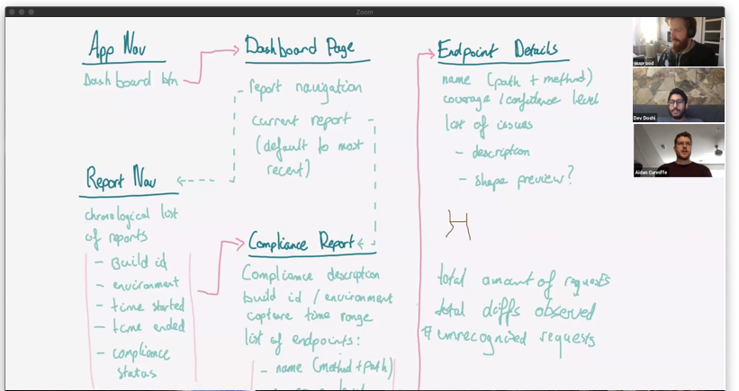

import { TwitterFollowButton  } from 'react-twitter-embed';
import GitHubButton from 'react-github-btn';

Before participating in the Optic community we ask that you read our [Code of Conduct](https://github.com/opticdev/.github/blob/master/CODE_OF_CONDUCT.md). The project has adopted the Contributor Covenant, and we expect all community members adhere to the guidelines within.

## [Join Optic on Discord](https://discord.gg/t9hADkuYjP)
Discord has become the online coffee-shop for all things Optic. Stop in for support, to ask questions about the project, request a feature, or comment on a pending RFC. If you're keen to contribute to the project, come introduce yourself on the `#contribute` channel.

## Support
- [Open an Issue on GitHub](https://github.com/opticdev/optic/issues/new) for bugs, poor performance, or compatibility issues
- Use `#ask-the-maintainers` channel on [Discord](https://discord.gg/t9hADkuYjP) for questions about using Optic on your team. Or DM `@acunniffe` (creator)

## Office Hours
Want to chat? Reach out directly to aidan@useoptic.com to set up a [Maintainers office Hours](https://calendly.com/opticlabs/maintainer-office-hours).

## News & Updates
- [Star & Watch Optic on GitHub](https://github.com/opticdev/optic)
- [Follow Optic on Twitter](https://twitter.com/@useoptic)
- [Read our Blog](/blog)

  

  <GitHubButton
    href="https://github.com/opticdev/optic"
    data-icon="octicon-star"
    data-size="small"
    data-show-count="true"
    aria-label="Star opticdev/optic on GitHub"
  >
    Star
  </GitHubButton>
  

  <TwitterFollowButton
    screenName={'useoptic'}
  />

## [Get Involved](/docs/optic/get-involved)
Some of the most valuable contributions to an open source project are written in prose, not code. Developers taking the time to share their feedback, perspective, and ideas with the broader community are the oxygen of big projects like Optic.

- ** 💡 Share feedback + ideas**
- ** 📣 Blog, Tweet or give a talk about Optic**
- ** 👩‍💻 Contribute Code or Documentation**

<!-- ALL-CONTRIBUTORS-LIST:START - Do not remove or modify this section -->
<!-- prettier-ignore-start -->
<!-- markdownlint-disable -->
<table>
  <tr>
    <td align="center"><a href="http://aidancunniffe.com"> <b>Aidan Cunniffe</b></a> <a href="https://github.com/opticdev/Optic/commits?author=acunniffe" title="Documentation">📖</a> <a href="https://github.com/opticdev/Optic/commits?author=acunniffe" title="Code">💻</a></td>
    <td align="center"><a href="https://devdoshi.com"> <b>devdoshi</b></a> <a href="https://github.com/opticdev/Optic/commits?author=devdoshi" title="Documentation">📖</a> <a href="https://github.com/opticdev/Optic/commits?author=devdoshi" title="Code">💻</a></td>
    <td align="center"><a href="https://www.take2.co/consulting-development"> <b>Evan Mallory</b></a> <a href="https://github.com/opticdev/Optic/commits?author=esopian" title="Documentation">📖</a></td>
    <td align="center"><a href="http://www.jaaprood.nl/"> <b>Jaap van Hardeveld</b></a> <a href="https://github.com/opticdev/Optic/commits?author=JaapRood" title="Code">💻</a> <a href="https://github.com/opticdev/Optic/commits?author=JaapRood" title="Documentation">📖</a></td>
    <td align="center"><a href="https://twitter.com/trulyronak"> <b>Ronak Shah</b></a> <a href="https://github.com/opticdev/Optic/commits?author=trulyronak" title="Code">💻</a> <a href="https://github.com/opticdev/Optic/commits?author=trulyronak" title="Documentation">📖</a></td>
    <td align="center"><a href="https://github.com/taraedits"> <b>taraedits</b></a> <a href="https://github.com/opticdev/Optic/commits?author=taraedits" title="Documentation">📖</a></td>
    <td align="center"><a href="https://github.com/LouManglass"> <b>Lou Manglass</b></a> <a href="https://github.com/opticdev/Optic/commits?author=LouManglass" title="Code">💻</a> <a href="https://github.com/opticdev/Optic/commits?author=LouManglass" title="Documentation">📖</a></td>
  </tr>
  <tr>
    <td align="center"><a href="https://github.com/notnmeyer"> <b>Nate Meyer</b></a> <a href="https://github.com/opticdev/Optic/commits?author=notnmeyer" title="Code">💻</a></td>
    <td align="center"><a href="https://github.com/timgates42"> <b>Tim Gates</b></a> <a href="https://github.com/opticdev/Optic/commits?author=timgates42" title="Documentation">📖</a></td>
    <td align="center"><a href="https://github.com/matthewhudson"> <b>Matthew Hudson</b></a> <a href="https://github.com/opticdev/Optic/commits?author=matthewhudson" title="Documentation">📖</a></td>
    <td align="center"><a href="https://github.com/lvenier"> <b>LaV</b></a> <a href="https://github.com/opticdev/Optic/commits?author=lvenier" title="Documentation">📖</a></td>
    <td align="center"><a href="https://github.com/gaurav-nelson"> <b>Gaurav Nelson</b></a> <a href="https://github.com/opticdev/Optic/commits?author=gaurav-nelson" title="Documentation">📖</a></td>
    <td align="center"><a href="http://ross-nordstrom.github.io/"> <b>Ross Nordstrom</b></a> <a href="#design-ross-nordstrom" title="Design">🎨</a> <a href="https://github.com/opticdev/Optic/commits?author=ross-nordstrom" title="Code">💻</a> <a href="https://github.com/opticdev/Optic/issues?q=author%3Aross-nordstrom" title="Bug reports">🐛</a></td>
    <td align="center"><a href="http://kinlane.com/"> <b>Kin Lane</b></a> <a href="#ideas-kinlane" title="Ideas, Planning, & Feedback">🤔</a> <a href="#content-kinlane" title="Content">🖋</a></td>
  </tr>
  <tr>
    <td align="center"><a href="https://viljami.io/"> <b>Viljami Kuosmanen</b></a> <a href="#ideas-anttiviljami" title="Ideas, Planning, & Feedback">🤔</a> <a href="#content-anttiviljami" title="Content">🖋</a></td>
    <td align="center"><a href="http://rcrowley.org/"> <b>Richard Crowley</b></a> <a href="#research-rcrowley" title="Research">🔬</a> <a href="#ideas-rcrowley" title="Ideas, Planning, & Feedback">🤔</a></td>
    <td align="center"><a href="https://github.com/danMateer"> <b>dnmtr</b></a> <a href="https://github.com/opticdev/Optic/pulls?q=is%3Apr+reviewed-by%3AdanMateer" title="Reviewed Pull Requests">👀</a></td>
    <td align="center"><a href="https://tim.fyi/"> <b>Tim Perry</b></a> <a href="https://github.com/opticdev/Optic/commits?author=pimterry" title="Code">💻</a></td>
    <td align="center"><a href="https://github.com/jordaniza"> <b>jordaniza</b></a> <a href="https://github.com/opticdev/Optic/commits?author=jordaniza" title="Documentation">📖</a></td>
    <td align="center"><a href="https://github.com/svanderbleek"> <b>Sandy Vanderbleek</b></a> <a href="https://github.com/opticdev/Optic/commits?author=svanderbleek" title="Documentation">📖</a></td>
    <td align="center"><a href="http://blog.urth.org/"> <b>Dave Rolsky</b></a> <a href="https://github.com/opticdev/Optic/commits?author=autarch" title="Documentation">📖</a></td>
  </tr>
</table>

<!-- markdownlint-restore -->
<!-- prettier-ignore-end -->

<!-- ALL-CONTRIBUTORS-LIST:END -->

**[Click here to start!](/docs/optic/get-involved)**
