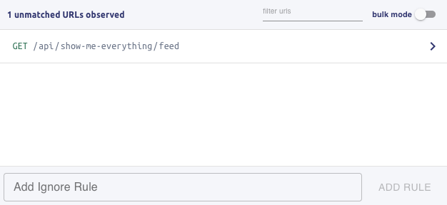
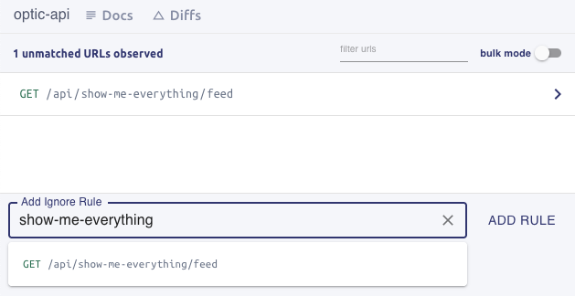
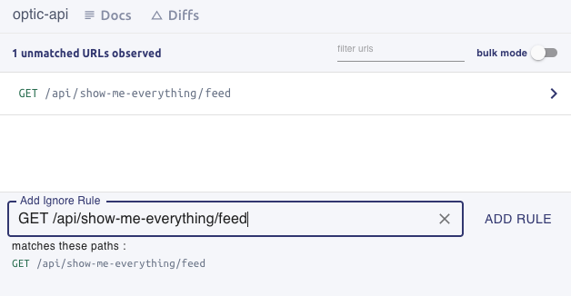

:::info API Baselining
When you run `api init` Optic begins tracking your API's evolution. Just like a new Git repo starts empty, the API spec Optic maintains is empty at first. The community has started calling this initial phase, where all the existing endpoints are added to the spec "Baselining".

It's not uncommon for a team to baseline 200+ endpoints during their first day using Optic -- which can be equivalent to 15-20k lines of OpenAPI.
:::

### Traffic → Spec

Optic learns your API specification by observing traffic in your development environments. This traffic can come from any source, you just want it to be representative of your API's behavior and cover the surface area.

You don't have to worry too much about hitting every possible request/response your first go -- Optic isn't "one-shot", it builds your spec up incrementally as it makes more observations about your API's behavior. If it sees a `200` for an endpoint, and later sees a `400` for the same endpoint, it will help you add the new response -- same for fields, requests, entire endpoints and polymorphism in your API.

- Run [`api start`](/docs/get-started/config) and exercise your endpoints using Curl or Postman
- [Run your API Tests](/docs/get-started/testing) with Optic
- Use a web/mobile consumer that exercises the API. Clicking through every page of your app usually results in good coverage.

### Providing Paths
After you have collected some traffic with Optic, it's time to document the endpoints they represent. Each endpoint is defined by its pattern and HTTP method: `GET /todos/{todoId}/status`.

Defining your API's paths is one of the few tasks you have to do manually. The maintainers have deliberately chosen to avoid inference of your API's paths or trying to pick a human-friendly name to describe that endpoint's function.

Using your knowledge of the API and the Optic UI, indicate which components of these URLs are parameters and which are constants:
- `/todos/abcdef` -> `/todos/{todoId}`
- `/flights/LAX/LGA -> `/flights/{origin}/{destination}`

As you work through the new endpoints, you'll see the number of "Endpoints to Document" increment. When you're finished, click "Finalize", add a message ie "Baselining the API" and click "Apply".

import {LoomVideo} from '../../src/components/LoomVideo';

<LoomVideo url={"https://www.loom.com/embed/0d9209f6cf704ed99192f945e52d4bd4"} />

### Naming Endpoints and adding Descriptions
Optic takes responsibility for maintaining an accurate API specification, so you can focus on building great software, not writing specs.

You can name your endpoints, and contribute additional descriptions to the specification using the Optic UI. Adding descriptions, helpful hints, and relevant context makes working with your API easier and pleasant. Today descriptions can be added to:

- **Endpoints** *both a name and a description are allowed*
- **Fields**
- **Query/Header Parameters**
- **Each Request Content Type**
- **Each Response Status Code + Content Type**

Even when you update your specification using Optic, the descriptions will continue to associate with the part of the API they describe.

### Repeat for new Endpoints
Once your API is baselined, you can continue using Optic to document new endpoints as they get built. New URLs Optic observes will produce diffs in the UI and encourage you to add the new endpoint to your specification. Just like you use `git add <file>` to include new source code in your PR, you can use Optic to document any new endpoints you create for a) review by your team and b) to share with your consumers.

### Ignoring endpoints

While baselining your API, you may run across some endpoints that aren't helpful to document. You can safely skip any endpoints that you don't want to document now, but may want to document at a later date. These endpoints will continue to show up as long as requests to them are observed. This is fine for endpoints you didn't mean to visit, or endpoints which you intend to document soon.

For endpoints which you don't ever intend to document, or endpoints that won't be documented in the near future, a stricter option is to set up an **ignore rule**. Ignore rules allow you to specify a path or expression to ignore in this and future captures. The ignore rules are stored in a configuration file, and can be removed at any time should your requirements change. Ignoring only affects the review UI: other than omitting endpoints that match the ignore rules from the Optic review dashboard, there are no changes to your API documentation workflow.

To ignore an endpoint, start typing part of the path of the endpoint in the **Add Ignore Rule** field. Optic will suggest endpoints that match.

Click on the desired path, and Optic will automatically generate an ignore rule. In this case, we're ignoring the `/api/show-me-everything/feed` GET endpoint. Clicking **Add Rule** will add this to the Optic ignore rule configuration. This removes the endpoint from the current list of unmatched URLs observed, and it will no longer show up in future review sessions. 

Note the method at the start of the ignore rule string. Ignore rules start with a method, or if no method is present, the rule applies to all methods. You may also use `(.*)` as a wildcard character to match multiple paths. For example, to ignore any endpoints at `/api/show-me-everything` and under it, enter the ignore rule `/api/show-me-everything(.*)`. Optic will show which endpoints match the wildcard rule, giving you an opportunity to review it before adding the rule.

Ignore rules are stored in `.optic/ignore`, where you can review them at any time. Please review the [ignore rule format](/docs/using/advanced-configuration#ignoring-api-paths) to learn more about the options available for ignore rules and how to manage the configuration file.