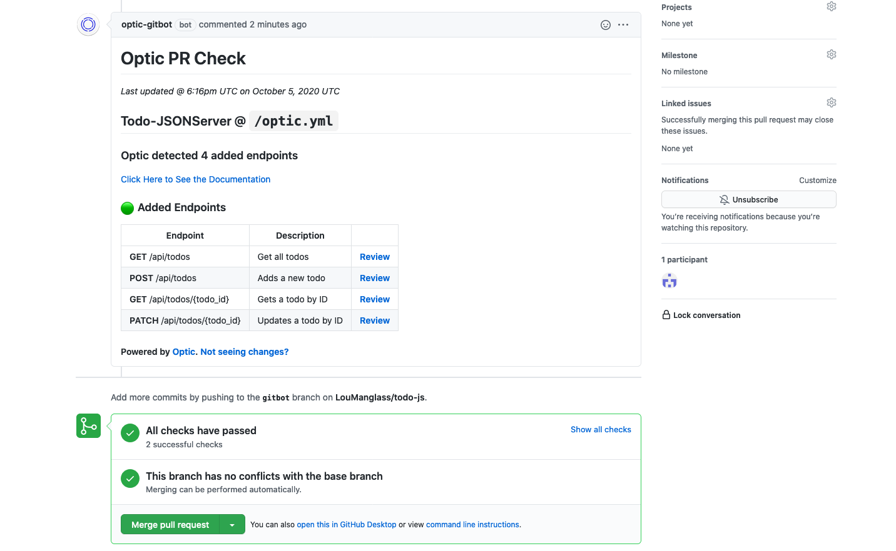

Optic was built on the premise that writing and updating API specifications should be as easy as making a Git commit and testing your APIs should not be a full-time job. We all want API specifications, to follow the best practices, and to have good change management of our APIs -- you can get there with OpenAPI, but it's not easy. Optic tries to automate the important workflows to make them developer-friendly and accessible to every team.

Now your team can make sure every API change is documented, reviewed, and approved. It's amazing how many second and third order benefits teams report just from having observability into how their APIs work and having "API Changes" as an explicit, first-class concern in every Pull Request.

So you've tried Optic, and want to get your team on-board. Here's what we've seen work so far:

### Set your team up for success

**Make Optic easy**
1. Provide an `api start` alias in the `optic.yml` file
2. Provide task aliases for your test suites and any local automation your developers use ie `api run tests`, `api run postman-tests`

[See documentation here](/docs/get-started/config)

**Provide an API Baseline**
Take the time to document your entire API in Optic and name all the endpoints in the spec. Providing a solid API baseline, ensures that the first experience your teammates have with Optic is a positive one. You want the first diffs Optic finds for them to be meaningful and related to the work they're currently doing.

### Check-in Optic

Now it's time to check-in Optic. If you used `api init` to add Optic to your project, you should already have a `.gitignore` in your `.optic` folder that makes sure you don't check in `.optic/captures`, this is where Optic keeps the working copy of API traffic it observed.

You should check-in these:
- `optic.yml` - shares the command aliases (`api start`, `api run tests`, etc) with everyone on your team
- `.optic/api/specification` - the log of every API change since you ran `api init`
- `.optic/ignore` - API paths ignored by Optic (ie those ending in `.js`, `.html`, etc)
- `.optic/.gitignore` - a .gitignore file to make sure no one else checks in captures

```bash
optic.yml
.optic/
├── .gitignore
├── api
│   ├── specification.json
├── captures
└── ignore
```

### Install the Optic GitBot

Once you've checked-in Optic, the GitBot will start commenting on API PRs that include changes to the API's contract. It's like adding a "API Changes" tab next to "Files Changed".

import Paper from '@material-ui/core/Paper';

<Paper elevation={2}>



</Paper>

[Setup instructions here](/docs/apiops/pull-requests)


---

### (Bonus) Schedule a demo for your team with Optic's maintainers

We're always trying to improve the experience of using Optic and we learn as much from doing these demos as your team does. Feel free to schedule a Zoom 30 min call for us to answer questions, do a live demo, take your features requests, and help your everyone get setup.

Feel free to book some time [on our calendar](https://calendly.com/opticlabs/optic-demo-with-the-maintainers). Chat soon 👋

